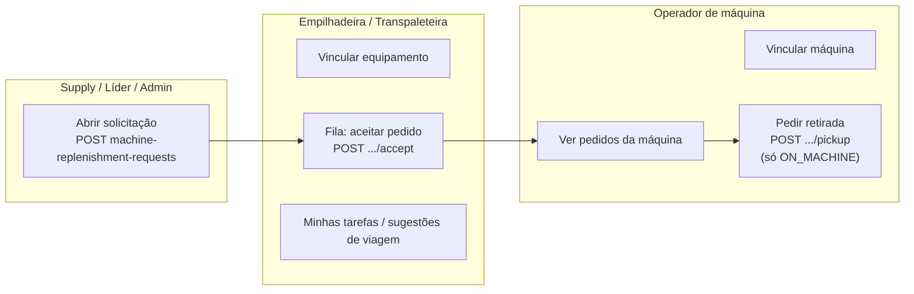
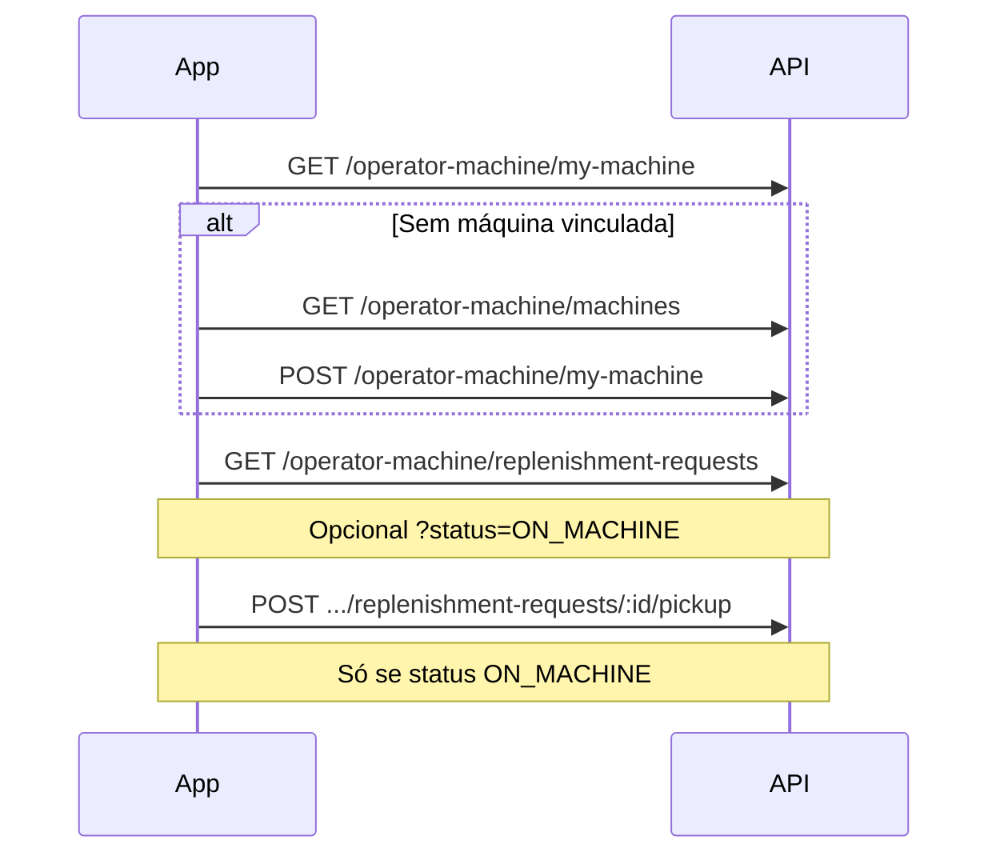
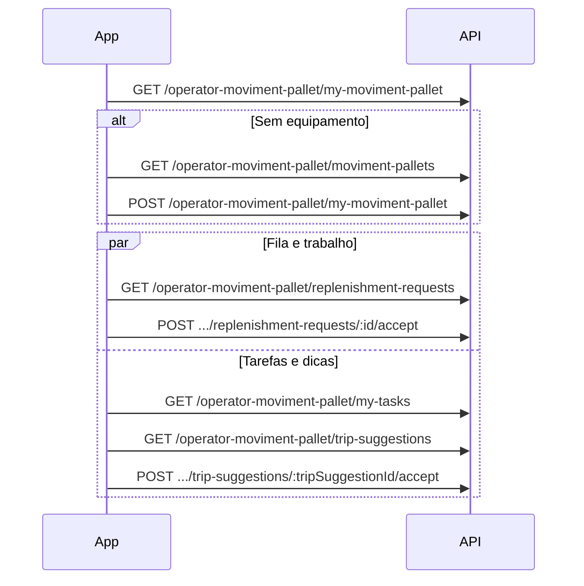

# Fluxos por papel e separação de telas (front-end)

Este documento descreve **o que cada usuário faz**, em **que ordem**, e **como quebrar em telas** no app.  
Complementa [`ROTAS_POR_ROLE.md`](./ROTAS_POR_ROLE.md) (permissões HTTP) e [`REGRAS_NEGOCIO_REPOSICAO_OPERADOR.md`](./REGRAS_NEGOCIO_REPOSICAO_OPERADOR.md) (regras e pré-condições da API).

**Base da API:** prefixo `/api`. Todas as chamadas autenticadas usam JWT no header `Authorization`.

---

## Visão geral do processo de reposição

Várias pessoas participam do mesmo **pedido** (`MachineReplenishmentRequest`), cada uma com **rotas e telas diferentes**.

**Importante para o front:** hoje a API **não** muda sozinha o status da requisição para `ON_MACHINE` após a entrega (ver regras de negócio). Em ambiente real, o fluxo “cubo chegou na máquina” pode depender de **evolução futura** da API ou de dados já corretos no banco para testes.

---

## Após o login: roteamento por `role`

1. `POST /api/auth/login` → guardar token.
2. `GET /api/auth/me` → ler `role`, `sectorId`, nome, etc.
3. Redirecionar para o **módulo** correspondente ao papel (abaixo). **Não** monte menus com rotas que o papel não pode chamar (retorno **403**).

| `role` | Módulo principal sugerido |
|--------|---------------------------|
| `ADMIN` | Área administrativa completa + atalhos de teste para operadores |
| `LEADER` | Cadastros + solicitações + criar usuário |
| `SUPPLY_OPERATOR` | Cadastros (máquinas, tipos, equipamentos) + solicitações |
| `OPERATOR_MACHINE` | Somente fluxo **operador de máquina** |
| `FORKLIFT_OPERATOR` | Somente fluxo **operador de movimentação** (empilhadeira) |
| `FOLLOW_UP_OPERATOR` | Somente fluxo **operador de movimentação** (transpaleteira) |
| `SUPERVISOR`, `MANAGER` | Hoje: apenas conta (me / senha) até existirem rotas específicas |

---

## `SUPPLY_OPERATOR` — fluxo e telas

**Objetivo:** manter cadastros do setor e **abrir/acompanhar** solicitações de reposição.

### Telas sugeridas (módulo “Supply”)

| # | Tela (nome sugerido) | O que faz na API |
|---|----------------------|------------------|
| 1 | **Início / dashboard** (opcional) | `GET /api/auth/me` (validar `sectorId` para mensagens) |
| 2 | **Tipos de máquina** (lista + form CRUD) | `/api/type-machines` |
| 3 | **Máquinas** (lista + form CRUD) | `/api/machines` |
| 4 | **Equipamentos de movimentação** (lista + form CRUD) | `/api/moviment-pallets` |
| 5 | **Nova solicitação de reposição** | `POST /api/machine-replenishment-requests` |
| 6 | **Lista de solicitações** | `GET /api/machine-replenishment-requests` |
| 7 | **Detalhe da solicitação** | `GET /api/machine-replenishment-requests/:requestId` |
| 8 | **Editar / cancelar** (se aplicável) | `PATCH`, `DELETE` no mesmo recurso |

### Ordem típica do dia

1. (Opcional) Conferir cadastros: máquinas e equipamentos com `sectorId` coerente com os operadores.
2. Abrir solicitações com **tipo de movimentação** correto (`FORKLIFT` ou `PALLET_TRUCK`) — define quem pode pegar na fila.
3. Acompanhar lista/detalhe até status final ou cancelamento.

**Separação:** cadastros (telas 2–4) vs. operação de pedidos (telas 5–8) — pode ser menu em duas seções.

---

## `LEADER` — fluxo e telas

**Objetivo:** igual ao **supply** nos cadastros e solicitações, **mais** criação de usuário.

### Telas extras em relação ao `SUPPLY_OPERATOR`

| Tela | API |
|------|-----|
| **Criar usuário** | `POST /api/users` |

**Não** incluir (403): listagem geral de usuários, papéis, reset de senha, CRUD de setores — isso é **`ADMIN`**.

---

## `ADMIN` — fluxo e telas

**Objetivo:** tudo que os outros papéis fazem, **mais** gestão global.

### Módulos sugeridos

1. **Usuários** — lista, roles, criar (`POST /api/users` também), alterar papel, reset senha, `employee-info` se usar.
2. **Setores** — CRUD `/api/sectors`.
3. **Mesmas telas de cadastro e solicitação** que `LEADER` / `SUPPLY_OPERATOR` (`type-machines`, `machines`, `moviment-pallets`, `machine-replenishment-requests`).
4. **Testes de operador** (opcional): mesmas telas/fluxos de `OPERATOR_MACHINE` e `FORKLIFT_OPERATOR` / `FOLLOW_UP_OPERATOR` usando as rotas `operator-machine` e `operator-moviment-pallet`.

**Separação:** menu “Administração” (usuários + setores) separado de “Operação / cadastro de chão” e de “Simulação operador”.

---

## `OPERATOR_MACHINE` — fluxo e telas

**Objetivo:** escolher **uma máquina** no turno, ver **pedidos dessa máquina**, solicitar **retirada** quando o pedido estiver `ON_MACHINE`.

### Fluxo em sequência

### Telas sugeridas

| # | Tela | Chamadas principais |
|---|------|---------------------|
| 1 | **Turno: minha máquina** | `GET /api/operator-machine/my-machine` |
| 2 | **Escolher máquina** (se `machine === null`) | `GET /api/operator-machine/machines` → `POST /api/operator-machine/my-machine` |
| 3 | **Pedidos da minha máquina** | `GET /api/operator-machine/replenishment-requests` (filtro `status` opcional) |
| 4 | **Confirmar retirada** (ação na lista ou detalhe) | `POST /api/operator-machine/replenishment-requests/:requestId/pickup` |
| 5 | **Fim de turno / trocar máquina** | `DELETE /api/operator-machine/my-machine` |

**UX:** se `user.sectorId` for nulo, a lista de máquinas vem vazia — a tela deve avisar que o cadastro precisa de setor.

**Separação:** uma área “Turno” (telas 1–2) e outra “Pedidos” (3–4); desvincular (5) no cabeçalho ou menu de turno.

---

## `FORKLIFT_OPERATOR` e `FOLLOW_UP_OPERATOR` — fluxo e telas

**Objetivo:** vincular **um equipamento** (`MovimentPallet`), ver **fila** de solicitações compatíveis, **aceitar** pedidos, executar/atender via **minhas tarefas** e opcionalmente **sugestões de viagem**.

A API **diferencia** empilhadeira vs transpaleteira pelo **tipo do equipamento** e pelo `role`; o fluxo de telas é o **mesmo**, mudando só o tipo de equipamento listado.

### Fluxo em sequência

### Telas sugeridas

| # | Tela | Chamadas principais |
|---|------|---------------------|
| 1 | **Turno: meu equipamento** | `GET /api/operator-moviment-pallet/my-moviment-pallet` |
| 2 | **Escolher equipamento** | `GET /api/operator-moviment-pallet/moviment-pallets` → `POST /api/operator-moviment-pallet/my-moviment-pallet` |
| 3 | **Fila (pedidos para aceitar)** | `GET /api/operator-moviment-pallet/replenishment-requests` |
| 4 | **Aceitar pedido** (ação) | `POST /api/operator-moviment-pallet/replenishment-requests/:requestId/accept` |
| 5 | **Minhas tarefas** | `GET /api/operator-moviment-pallet/my-tasks` |
| 6 | **Sugestões de viagem** (economia de trajeto) | `GET /api/operator-moviment-pallet/trip-suggestions` |
| 7 | **Aceitar sugestão** (se o produto usar) | `POST /api/operator-moviment-pallet/trip-suggestions/:tripSuggestionId/accept` |
| 8 | **Fim de turno** | `DELETE /api/operator-moviment-pallet/my-moviment-pallet` |

**Separação recomendada no app:**

- **Aba ou rota “Fila”** — telas 3–4 (só faz sentido com equipamento vinculado; sem vínculo, lista vazia).
- **Aba ou rota “Minhas tarefas”** — tela 5 (trabalho já atribuído ao equipamento).
- **Aba ou rota “Sugestões”** — telas 6–7 (leitura + ação opcional).
- **Configuração de turno** — telas 1–2 e 8 (pode ser um wizard no primeiro acesso do dia).

**Nota:** `GET /trip-suggestions` no doc de negócio não exige equipamento vinculado; `GET` da fila e `accept` do pedido **exigem** vínculo — o front pode esconder ou desabilitar “Fila” até existir `my-moviment-pallet`.

---

## `SUPERVISOR` e `MANAGER`

Hoje **não há** rotas de negócio específicas: após login, use apenas telas de **perfil** (`GET /api/auth/me`, `POST /api/auth/password`) ou mensagem “sem módulo disponível” até o back-end liberar permissões.

---

## Telas comuns a todos os autenticados

| Tela | API |
|------|-----|
| **Perfil / alterar senha** | `GET /api/auth/me`, `POST /api/auth/password` |
| **Login** | `POST /api/auth/login` (público) |

---

## Checklist rápido para o time de front

1. **Router guard** por `role` alinhado a [`ROTAS_POR_ROLE.md`](./ROTAS_POR_ROLE.md).
2. **Operadores:** sempre tratar `sectorId` ausente (listas vazias ou erro 400 ao vincular).
3. **Operador de máquina:** ação de retirada só para itens com `status === ON_MACHINE` (e tratamento de **409**).
4. **Operador de movimentação:** fila e tipo de equipamento coerentes com `REGRAS_NEGOCIO_REPOSICAO_OPERADOR.md`.
5. **Roadmap:** quando existir endpoint para marcar entrega / `ON_MACHINE`, incluir tela no fluxo do empilhadeirista e ajustar este documento.

---

## Referência de código

- Registro de rotas: `back-end/src/routes/main.ts`
- Papéis: `back-end/src/middleware/require-roles.ts`
