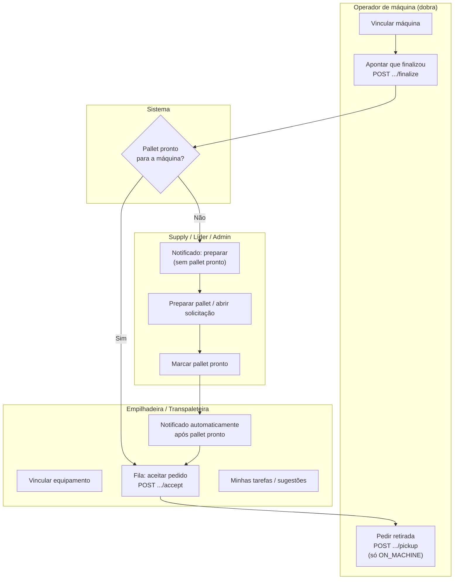
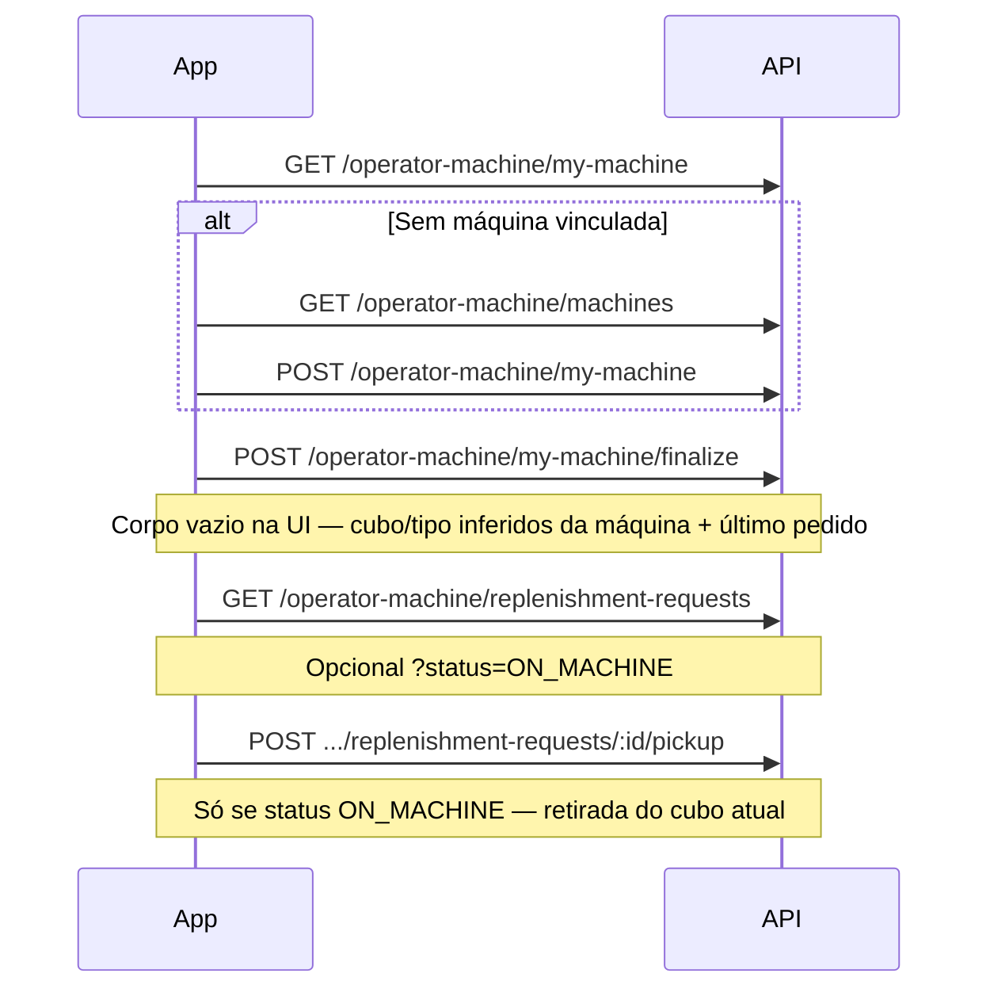
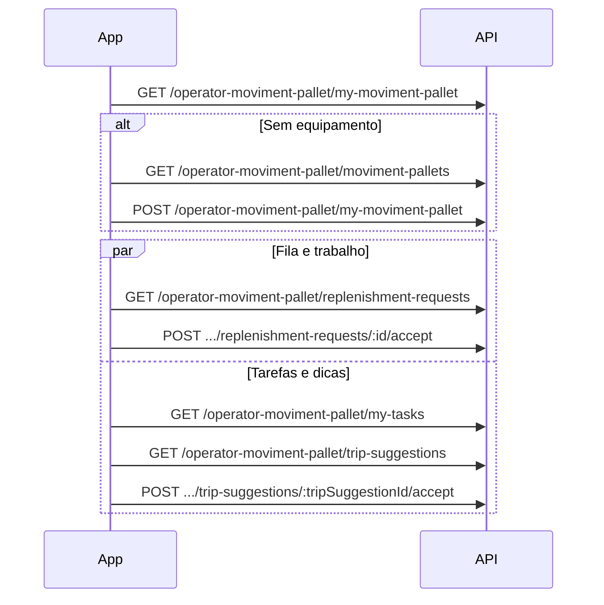

# Fluxos por papel e separação de telas (front-end)

Este documento descreve **o que cada usuário faz**, em **que ordem**, e **como quebrar em telas** no app.  
Complementa [`ROTAS_POR_ROLE.md`](./ROTAS_POR_ROLE.md) (permissões HTTP) e [`REGRAS_NEGOCIO_REPOSICAO_OPERADOR.md`](./REGRAS_NEGOCIO_REPOSICAO_OPERADOR.md) (regras e pré-condições da API).

**Matriz implementado vs pendente (back-end + front):** [`STATUS_IMPLEMENTACAO.md`](./STATUS_IMPLEMENTACAO.md)  
**Mapa da planta (supervisão — especificação):** [`MAPA_PLANTA_SUPERVISAO.md`](./MAPA_PLANTA_SUPERVISAO.md)

**Base da API:** prefixo `/api`. Todas as chamadas autenticadas usam JWT no header `Authorization`.

**Legenda nas tabelas de telas:** **✅** pode ser construída hoje (API existe) · **❌** depende de rota/regra ainda não implementada · **⚠️** tela parcial (parte da API pronta).

---

## Status das telas (resumo)

| Papel | ✅ API pronta (telas possíveis) | ❌ API ainda não (não chamar rota inexistente) |
|-------|--------------------------------|-----------------------------------------------|
| **LEADER**, **SUPERVISOR**, **MANAGER**, **ADMIN** | Tela **Mapa da planta** (`GET` máquinas + pedidos para painel lateral) | Desenho de áreas expedição/recebimento; persistência de coordenadas dedicada (ver [`MAPA_PLANTA_SUPERVISAO.md`](./MAPA_PLANTA_SUPERVISAO.md)) |
| **SUPPLY_OPERATOR** | CRUD tipos, máquinas; solicitações; `pending-preparation`; marcar pallet pronto | Push em tempo real (opcional) |
| **OPERATOR_MACHINE** | Turno/máquina; **Finalizei** (`POST .../finalize`, corpo vazio na UI); pedidos; retirada | Push em tempo real (opcional) |
| **FORKLIFT / FOLLOW_UP** | Equipamento, fila, aceitar, tarefas, sugestões, concluir entrega/retirada | Notificações §9 (opcional) |
| **Front-end geral** | Login, guards, páginas cadastro máquinas/tipos | Módulos operador, supply completo, transporte |

Diagrama abaixo: fluxo **§9** já coberto pela API; itens **❌** no back-end referem-se sobretudo a **push** em tempo real (opcional).

---

## Visão geral do processo de reposição

Várias pessoas participam do mesmo **pedido** (`MachineReplenishmentRequest`), cada uma com **rotas e telas diferentes**.

**Orquestração “finalizei na dobra” (✅):** regra em §9 de `REGRAS_NEGOCIO_*`; rotas em [`STATUS_IMPLEMENTACAO.md`](./STATUS_IMPLEMENTACAO.md).

**Entrega na máquina (✅):** transporte usa `POST .../complete-deliver` → requisição vai para `ON_MACHINE`; operador de máquina pode então usar `pickup`.

---

## Após o login: roteamento por `role`

1. `POST /api/auth/login` → guardar token.
2. `GET /api/auth/me` → ler `role`, `sectorId`, nome, etc.
3. Redirecionar para o **módulo** correspondente ao papel (abaixo). **Não** monte menus com rotas que o papel não pode chamar (retorno **403**).

| `role` | Módulo principal sugerido |
|--------|---------------------------|
| `ADMIN` | Área administrativa completa + atalhos de teste para operadores + **mapa da planta** |
| `LEADER` | Cadastros + solicitações + criar usuário + **mapa da planta** |
| `SUPPLY_OPERATOR` | Cadastros (máquinas, tipos, equipamentos) + solicitações |
| `OPERATOR_MACHINE` | Somente fluxo **operador de máquina** |
| `FORKLIFT_OPERATOR` | Somente fluxo **operador de movimentação** (empilhadeira) |
| `FOLLOW_UP_OPERATOR` | Somente fluxo **operador de movimentação** (transpaleteira) |
| `SUPERVISOR`, `MANAGER` | **Mapa da planta** (leitura) + conta (me / senha); demais cadastros **403** |

**Mapa da planta** (`/supervisao/mapa-planta`): mesmas imagens de planta do Machine Logs; Konva (pan/zoom); máquinas em posição `MAP:nx,ny` no campo «Posição» ou grade automática; painel com status do pedido em aberto (tempo desde `updatedAt` do pedido — aproximação até existir campo dedicado). Áreas de expedição/recebimento: ver [`MAPA_PLANTA_SUPERVISAO.md`](./MAPA_PLANTA_SUPERVISAO.md).

---

## Fluxo transversal: dobra finalizou → pallet pronto ou preparo (planejado)

Referência completa: **§9** em [`REGRAS_NEGOCIO_REPOSICAO_OPERADOR.md`](./REGRAS_NEGOCIO_REPOSICAO_OPERADOR.md).

| Etapa | Status | Quem | O que o app deve mostrar |
|-------|--------|------|---------------------------|
| 1 | ✅ | **OPERATOR_MACHINE** | Botão **“Finalizei na dobra”** — chama `POST /api/operator-machine/my-machine/finalize` com **`{}`**. Cubo, tipo e prioridade vêm do vínculo com a máquina e do **histórico de pedidos** dessa máquina (API); **sem** campos manuais na tela. |
| 2 | ✅ | Sistema | Verificar **pallet pronto** para a máquina |
| 3a | ✅ | Transporte | Se sim: fila `replenishment-requests` + `accept` |
| 3b | ✅ | **SUPPLY_OPERATOR** | Lista `pending-preparation` / preparar pallet |
| 4 | ✅ | **SUPPLY_OPERATOR** | Ação **“Pallet pronto”** (`mark-pallet-ready`) |
| 5 | ⚠️ | Transporte | Polling `GET .../notifications` (**✅**); push automático **❌** (opcional futuro) |

**Pallet antecipado:** o supply pode marcar pallet pronto **antes** do operador de dobra finalizar; nesse caso, no passo 2 o sistema já encaminha direto para a fila de transporte (3a).

---

## `SUPPLY_OPERATOR` — fluxo e telas

**Objetivo:** manter cadastros do setor, **preparar pallets**, **abrir/acompanhar** solicitações e **atender avisos** quando a dobra finalizou sem cubo pronto.

### Telas sugeridas (módulo “Supply”)

| # | Status | Tela (nome sugerido) | O que faz na API |
|---|--------|----------------------|------------------|
| 1 | ✅ | **Início / dashboard** (opcional) | `GET /api/auth/me` |
| 2 | ✅ | **Tipos de máquina** | `/api/type-machines` |
| 3 | ✅ | **Máquinas** | `/api/machines` |
| 4 | ✅ | **Equipamentos de movimentação** | `/api/moviment-pallets` |
| 5 | ✅ | **Nova solicitação de reposição** | `POST /api/machine-replenishment-requests` |
| 6 | ✅ | **Lista de solicitações** | `GET /api/machine-replenishment-requests` |
| 7 | ✅ | **Detalhe da solicitação** | `GET /api/machine-replenishment-requests/:requestId` |
| 8 | ✅ | **Editar / cancelar** | `PATCH`, `DELETE` |
| 9 | ❌ | **Preparar pallet** | `GET .../pending-preparation` (não existe) |
| 10 | ❌ | **Marcar pallet pronto** | `POST .../mark-pallet-ready` (não existe) |

### Ordem típica do dia

1. (Opcional) Conferir cadastros: máquinas e equipamentos com `sectorId` coerente com os operadores.
2. **Antecipar** pallets: preparar e marcar **pronto** para máquinas de dobra com alta rotatividade (evita espera no ramo “sem pallet”).
3. Atender **notificações** “máquina X finalizou — preparar pallet” (fluxo §9 ramo B).
4. Abrir solicitações manuais quando necessário, com **tipo de movimentação** correto (`FORKLIFT` ou `PALLET_TRUCK`).
5. Ao concluir preparo, **marcar pallet pronto** — o transporte é informado sem passo manual extra.
6. Acompanhar lista/detalhe até status final ou cancelamento.

**Separação:** cadastros (telas 2–4) vs. operação de pedidos e preparo (telas 5–10) — pode ser menu em duas seções; notificações de preparo podem ser badge na área “Operação”.

---

## `LEADER` — fluxo e telas

**Objetivo:** igual ao **supply** nos cadastros e solicitações, **mais** criação de usuário.

### Telas extras em relação ao `SUPPLY_OPERATOR`

| Tela | API |
|------|-----|
| **Criar usuário** | `POST /api/users` |

**Não** incluir (403): listagem geral de usuários, papéis, reset de senha, CRUD de setores — isso é **`ADMIN`**.

---

## `ADMIN` — fluxo e telas

**Objetivo:** tudo que os outros papéis fazem, **mais** gestão global.

### Módulos sugeridos

1. **Usuários** — lista, roles, criar (`POST /api/users` também), alterar papel, reset senha, `employee-info` se usar.
2. **Setores** — CRUD `/api/sectors`.
3. **Mesmas telas de cadastro e solicitação** que `LEADER` / `SUPPLY_OPERATOR` (`type-machines`, `machines`, `moviment-pallets`, `machine-replenishment-requests`).
4. **Testes de operador** (opcional): mesmas telas/fluxos de `OPERATOR_MACHINE` e `FORKLIFT_OPERATOR` / `FOLLOW_UP_OPERATOR` usando as rotas `operator-machine` e `operator-moviment-pallet`.

**Separação:** menu “Administração” (usuários + setores) separado de “Operação / cadastro de chão” e de “Simulação operador”.

---

## `OPERATOR_MACHINE` — fluxo e telas

**Objetivo:** escolher **uma máquina** no turno (dobra), **apontar finalização** do ciclo para disparar a próxima reposição (§9), ver **pedidos dessa máquina** e solicitar **retirada** quando o pedido estiver `ON_MACHINE`.

### Fluxo em sequência

### Telas sugeridas

| # | Status | Tela | Chamadas principais |
|---|--------|------|---------------------|
| 1 | ✅ | **Turno: minha máquina** | `GET /api/operator-machine/my-machine` |
| 2 | ✅ | **Escolher máquina** | `GET .../machines` → `POST .../my-machine` |
| 3 | ✅ | **Produção — finalizei na dobra** | `POST .../my-machine/finalize` (corpo `{}` na tela) |
| 4 | ✅ | **Pedidos da minha máquina** | `GET .../replenishment-requests` |
| 5 | ✅ | **Confirmar retirada** | `POST .../pickup` (requer `ON_MACHINE`) |
| 6 | ✅ | **Fim de turno** | `DELETE .../my-machine` |

**UX:** se `user.sectorId` for nulo, a lista de máquinas vem vazia — a tela deve avisar que o cadastro precisa de setor.

**UX “Finalizei”:** tela com **apenas o botão** (sem cubo, tipo ou prioridade). Após sucesso, mostrar feedback conforme resposta da API — *“Pallet já pronto — transporte acionado”* vs *“Abastecimento notificado para preparar pallet”* (§9). Erro **400** por campos faltantes só ocorre se a API não tiver **nenhum** pedido anterior para inferir cubo/tipo (fluxo normal já deixa histórico na máquina).

**Separação:** área “Turno” (1–2, 6); área “Produção” com **Finalizei** (3); área “Pedidos / retirada” (4–5). Não confundir **finalizei** (próximo cubo) com **retirada** (cubo atual em `ON_MACHINE`).

---

## `FORKLIFT_OPERATOR` e `FOLLOW_UP_OPERATOR` — fluxo e telas

**Objetivo:** vincular **um equipamento** (`MovimentPallet`), ver **fila** de solicitações compatíveis (incluindo pedidos liberados após **pallet pronto** no supply ou após **finalizei** na dobra com pallet antecipado — §9), **aceitar** pedidos, executar/atender via **minhas tarefas** e opcionalmente **sugestões de viagem**.

A API **diferencia** empilhadeira vs transpaleteira pelo **tipo do equipamento** e pelo `role`; o fluxo de telas é o **mesmo**, mudando só o tipo de equipamento listado.

### Fluxo em sequência

### Telas sugeridas

| # | Status | Tela | Chamadas principais |
|---|--------|------|---------------------|
| 1 | ✅ | **Turno: meu equipamento** | `GET .../my-moviment-pallet` |
| 2 | ✅ | **Escolher equipamento** | `GET .../moviment-pallets` → `POST .../my-moviment-pallet` |
| 3 | ✅ | **Fila** | `GET .../replenishment-requests` |
| 4 | ✅ | **Aceitar pedido** | `POST .../replenishment-requests/:id/accept` |
| 4b | ❌ | **Notificações** | `GET .../notifications` (opcional §9) |
| 5 | ✅ | **Minhas tarefas** | `GET .../my-tasks`, `GET .../active-flow` |
| 5b | ✅ | **Concluir entrega / retirada** | `POST .../complete-deliver`, `complete-pickup`, `accept-pickup` |
| 6 | ✅ | **Sugestões de viagem** | `GET .../trip-suggestions` |
| 7 | ✅ | **Aceitar sugestão** | `POST .../trip-suggestions/:id/accept` |
| 8 | ✅ | **Fim de turno** | `DELETE .../my-moviment-pallet` |

**Separação recomendada no app:**

- **Aba ou rota “Fila”** — telas 3–4 (só faz sentido com equipamento vinculado; sem vínculo, lista vazia).
- **Aba ou rota “Minhas tarefas”** — tela 5 (trabalho já atribuído ao equipamento).
- **Aba ou rota “Sugestões”** — telas 6–7 (leitura + ação opcional).
- **Configuração de turno** — telas 1–2 e 8 (pode ser um wizard no primeiro acesso do dia).

**Nota:** `GET /trip-suggestions` no doc de negócio não exige equipamento vinculado; `GET` da fila e `accept` do pedido **exigem** vínculo — o front pode esconder ou desabilitar “Fila” até existir `my-moviment-pallet`.

---

## `SUPERVISOR` e `MANAGER`

Hoje **não há** rotas de negócio específicas: após login, use apenas telas de **perfil** (`GET /api/auth/me`, `POST /api/auth/password`) ou mensagem “sem módulo disponível” até o back-end liberar permissões.

---

## Telas comuns a todos os autenticados

| Tela | API |
|------|-----|
| **Perfil / alterar senha** | `GET /api/auth/me`, `POST /api/auth/password` |
| **Login** | `POST /api/auth/login` (público) |

---

## Checklist rápido para o time de front

1. **Router guard** por `role` alinhado a [`ROTAS_POR_ROLE.md`](./ROTAS_POR_ROLE.md).
2. Consultar [`STATUS_IMPLEMENTACAO.md`](./STATUS_IMPLEMENTACAO.md) antes de integrar telas **❌**.
3. **Operadores:** tratar `sectorId` ausente (listas vazias ou **400** ao vincular).
4. **Operador de máquina:** retirada só com `ON_MACHINE`; **Finalizei** com `POST .../finalize` e corpo vazio na UI (dados inferidos na API — ver `FLUXOS_TELAS_FRONTEND.md` § OPERATOR_MACHINE).
5. **Transporte:** incluir telas para `complete-deliver` e retirada (**✅** na API).
6. **§9:** implementado — ver [`STATUS_IMPLEMENTACAO.md`](./STATUS_IMPLEMENTACAO.md); falta apenas push/WebSocket se desejado.

---

## Referência de código

- Registro de rotas: `back-end/src/routes/main.ts`
- Papéis: `back-end/src/middleware/require-roles.ts`
