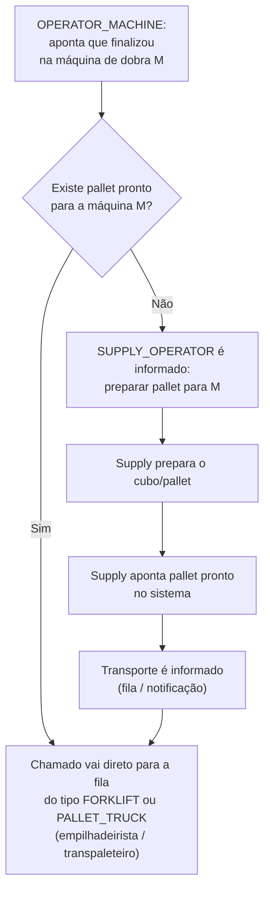

# Regras de negócio: reposição, operador de máquina e retirada de pallet

Documento de referência para os fluxos da API (`/api`): operador de máquina (`OPERATOR_MACHINE`), operador de movimentação (`FORKLIFT_OPERATOR` / `FOLLOW_UP_OPERATOR`), abastecimento (`SUPPLY_OPERATOR`) e pontos **já implementados** vs **planejados**.

> **Matriz completa (o que existe vs o que falta):** [`STATUS_IMPLEMENTACAO.md`](./STATUS_IMPLEMENTACAO.md)  
> Legenda neste arquivo: **✅ implementado** · **❌ não implementado** · **⚠️ parcial**

---

## 0. Resumo: implementado vs pendente

| Área | ✅ Já na API | ❌ Ainda não (ver §9 e `STATUS_IMPLEMENTACAO.md`) |
|------|-------------|-----------------------------------------------------|
| **Supply** | CRUD; `GET pending-preparation`; `POST mark-pallet-ready`; `palletReady` no `POST` | Push em tempo real (opcional) |
| **Operador de máquina** | Vínculo, pedidos, retirada, **`POST my-machine/finalize`** | — |
| **Transporte** | Fila (`PALLET_READY`), aceitar, entregar, retirada, **`GET notifications`** | Push (opcional) |
| **Modelo** | `AWAITING_PREPARATION`, `PALLET_READY`, `preparedAt`, `awaitingPreparationSince` | — |

**Fluxo §9:** **✅** implementado — ver **§9** e [`STATUS_IMPLEMENTACAO.md`](./STATUS_IMPLEMENTACAO.md).

**Fluxo clássico (supply abre → transporte entrega → retirada):** **✅** — ver §§4–7 (exceto melhorias opcionais de notificação).

---

## 1. Papéis envolvidos

| Papel | Responsabilidade neste fluxo |
|--------|-------------------------------|
| **SUPPLY_OPERATOR** (e **LEADER** / **ADMIN**) | **✅** Cadastros, solicitações, `pending-preparation`, `mark-pallet-ready`. |
| **OPERATOR_MACHINE** (máquina de **dobra**) | **✅** Vínculo, retirada (§4.7), **finalizei** (§4.6). |
| **FORKLIFT_OPERATOR** | Após login, vincula-se a um **equipamento de movimentação** do tipo **empilhadeira** (`MovimentPallet` com `type = FORKLIFT`), vê **solicitações e tarefas** apenas desse tipo e pode **aceitar** uma requisição em aberto (cria tarefa de entrega). |
| **FOLLOW_UP_OPERATOR** | Igual ao empilhadeirista no fluxo da API, porém apenas com equipamento **transpaleteira** (`type = PALLET_TRUCK`). |

---

## 2. Modelos principais (Prisma)

- **Machine** — `userId` opcional: operador atualmente vinculado à máquina (um operador por vez na mesma máquina; ver regra de vínculo abaixo).
- **MachineReplenishmentRequest** — pedido de abastecimento para uma **máquina de destino** (`destinationId`), com `movementCube`, `priorityLevel`, `requestedById` (quem abriu no supply), `status` (`RequestStatus`) e **`typeMovimentPallet`** (`FORKLIFT` ou `PALLET_TRUCK`): define qual fila de operador pode atender.
- **MovimentPallet** — equipamento físico (código único), **tipo** `FORKLIFT` (empilhadeira) ou `PALLET_TRUCK` (transpaleteira), setor opcional e **`operatorId`**: operador atualmente vinculado (um operador por vez; vínculo exclusivo no mesmo estilo da máquina).
- **MovimentPalletTask** — tarefa ligada à requisição via `requestId`: tipos `DELIVER_TO_MACHINE`, `ON_MACHINE`, `PICKUP_TO_EXPEDITION`; status `ForkliftTaskStatus`; pode ter **`assignedMovimentPalletId`** quando a tarefa é da fila do operador de movimentação.

---

## 3. Status da requisição (`RequestStatus`)

| Status | Significado sugerido |
|--------|----------------------|
| **CREATED** | Solicitação criada pelo supply; aguarda processamento / entrega. |
| **IN_PROGRESS** | Em andamento (ex.: entrega ou outras etapas — definir no fluxo do empilhadeirista). |
| **ON_MACHINE** | Pallet/cubo **já está na máquina de destino**; o **OPERATOR_MACHINE** pode solicitar **retirada** (criação da tarefa `PICKUP_TO_EXPEDITION`). |
| **COMPLETED** | Fluxo encerrado com sucesso. |
| **CANCELED** | Cancelado. |

**✅ Transição para `ON_MACHINE`:** ao concluir a entrega, o transporte chama **`POST /api/operator-moviment-pallet/tasks/:taskId/complete-deliver`** — a requisição passa para `ON_MACHINE` (serviço `completeDeliverTaskToMachine`).

**❌ Ainda não existe:** transição automática para `COMPLETED` após retirada concluída (verificar código atual ao implementar); distinção *em preparo* vs *pallet pronto* para o fluxo §9 (novo enum `PALLET_READY` ou campos `preparedAt` — ver [`STATUS_IMPLEMENTACAO.md`](./STATUS_IMPLEMENTACAO.md)).

---

## 4. Fluxo do operador de máquina (`OPERATOR_MACHINE`) — ✅ (exceto §4.6)

Base URL: **`/api/operator-machine`** — rotas exigem JWT com role **OPERATOR_MACHINE** ou **ADMIN** (testes).

### 4.1 Listar máquinas para escolher a de operação — ✅

- **`GET /operator-machine/machines`**
- Lista **apenas máquinas cujo `sectorId` é igual ao `sectorId` do usuário** (`User.sectorId` ↔ `Machine.sectorId`), ou seja, o mesmo setor (ex.: DOBRA).
- Se o operador **não tiver `sectorId`**, a lista vem **vazia** (é obrigatório ter setor no cadastro para escolher máquina).

### 4.2 Consultar máquina vinculada — ✅

- **`GET /operator-machine/my-machine`**
- Resposta: `{ "machine": { ... } | null }`.

### 4.3 Vincular-se à máquina de operação — ✅

- **`POST /operator-machine/my-machine`**
- Body: `{ "machineId": "<uuid>" }`.
- **Regras:**
  - O operador precisa ter **`sectorId`**; caso contrário, **400** (não pode vincular).
  - A máquina precisa existir (**404** se não existir).
  - A máquina deve estar no **mesmo setor** que o operador (`machine.sectorId === user.sectorId`); caso contrário, **403**.
  - Remove o vínculo deste operador de **qualquer outra** máquina (`Machine.userId`).
  - Associa o operador à máquina informada.
  - Se **outro** operador estava na mesma máquina, ele é **desvinculado** (substituição).

### 4.4 Desvincular (fim de turno / trocar depois) — ✅

- **`DELETE /operator-machine/my-machine`**
- Zera `userId` em todas as máquinas onde este operador estava vinculado.

### 4.5 Listar requisições da “minha” máquina — ✅

- **`GET /operator-machine/replenishment-requests`**
- Query opcional: **`?status=ON_MACHINE`** (ou outro valor de `RequestStatus`).
- Retorna apenas requisições cuja **máquina de destino** tem **`userId` igual ao operador logado** (ou seja: a máquina na qual ele está vinculado **é** o `destination` da requisição).

### 4.6 Apontar finalização na máquina de dobra (reposição antecipada) — ✅

- **`POST /operator-machine/my-machine/finalize`**
- Body opcional: `movementCube`, `typeMovimentPallet`, `priorityLevel`. Se omitidos, a API **reaproveita** cubo e tipo do **último** `MachineReplenishmentRequest` da máquina de destino (`findLatestByDestinationId`). A **tela do operador** envia corpo **vazio** (`{}`): o operador só confirma que finalizou; vínculo com a máquina e histórico bastam no fluxo normal. O body explícito continua útil para integrações / Bruno / primeiro pedido sem histórico na máquina.
- **Resposta:** `{ outcome: 'TRANSPORT_QUEUED' | 'SUPPLY_NOTIFIED', message, request }`.
- Implementação: `finalizeMachineProductionCycle` em `replenishment-orchestration.service.ts`.

- **Gatilho:** o **OPERATOR_MACHINE** vinculado à máquina de dobra M informa que **finalizou** o processo/ciclo atual naquela máquina (ação explícita no app, distinta de “pedir retirada” do cubo que já está em `ON_MACHINE`).
- **Efeito esperado:** o sistema avalia se já existe **pallet pronto** para a máquina M (§9.2). Não substitui o fluxo de retirada (§4.7) quando o cubo ainda está em cima da máquina.

**Pré-condições sugeridas (implementação futura):**

1. Operador vinculado à máquina M (`destination.userId` ou vínculo `Machine.userId`).
2. Máquina M no setor de dobra (ex.: setor **DOBRA**), conforme cadastro.
3. Não disparar nova orquestração se já houver pedido de reposição **em aberto** para M na mesma “rodada” (evitar duplicidade).

### 4.7 Solicitar retirada do pallet (quando `ON_MACHINE`) — ✅

- **`POST /operator-machine/replenishment-requests/:requestId/pickup`**
- **Pré-condições:**
  1. A requisição existe.
  2. **`destination.userId` === operador logado** (é da máquina dele).
  3. **`status === ON_MACHINE`**.
  4. Não existe outra **`MovimentPalletTask`** do tipo **`PICKUP_TO_EXPEDITION`** em status **CREATED**, **ASSIGNED** ou **IN_PROGRESS** para a mesma requisição.
- **Efeito:** cria **`MovimentPalletTask`** com `type = PICKUP_TO_EXPEDITION`, `status = CREATED`, `requestedById` = operador.
- **Resposta (201):** `{ "request": { ... }, "pickupTask": { ... } }`.
- Erros comuns: **403** (requisição não é da máquina do operador), **409** (status diferente de `ON_MACHINE` ou pickup já em aberto).

---

## 5. Fluxo do operador de movimentação (`FORKLIFT_OPERATOR` e `FOLLOW_UP_OPERATOR`) — ✅

Base URL: **`/api/operator-moviment-pallet`** — rotas exigem JWT com role **FORKLIFT_OPERATOR**, **FOLLOW_UP_OPERATOR** ou **ADMIN** (testes).  
Rotas extras implementadas (não listadas antes neste doc): `GET /active-flow`, `POST /tasks/:taskId/complete-deliver`, `complete-pickup`, `accept-pickup` — ver [`STATUS_IMPLEMENTACAO.md`](./STATUS_IMPLEMENTACAO.md).

### 5.1 Perfis e tipo de equipamento

| Papel | Tipo de `MovimentPallet` permitido |
|--------|-------------------------------------|
| **FORKLIFT_OPERATOR** | Somente **`FORKLIFT`** (empilhadeira). |
| **FOLLOW_UP_OPERATOR** | Somente **`PALLET_TRUCK`** (transpaleteira). |
| **ADMIN** | **Ambos** (para testes). |

O operador **só enxerga solicitações em aberto e tarefas** alinhadas ao **tipo do equipamento** ao qual está vinculado naquele momento (regra de visibilidade por `typeMovimentPallet` ↔ `MovimentPallet.type`).

### 5.2 Listar equipamentos para escolher o de operação

- **`GET /operator-moviment-pallet/moviment-pallets`**
- Lista **`MovimentPallet`** do **mesmo setor** do usuário (`User.sectorId` ↔ `MovimentPallet.sectorId`), **filtrado pelo tipo permitido ao papel** (tabela acima).
- Apenas equipamentos **sem operador** (`operatorId` nulo) **ou já vinculados ao próprio usuário** entram na lista (não aparecem os ocupados por outro operador).
- Se o usuário **não tiver `sectorId`**, a lista vem **vazia**.

### 5.3 Consultar equipamento vinculado

- **`GET /operator-moviment-pallet/my-moviment-pallet`**
- Resposta: equipamento atual ou `null`.

### 5.4 Vincular-se ao equipamento de movimentação

- **`POST /operator-moviment-pallet/my-moviment-pallet`**
- Body: `{ "movimentPalletId": "<uuid>" }`.
- **Regras:**
  - Operador precisa ter **`sectorId`**; caso contrário, **400**.
  - Equipamento deve existir (**404**).
  - **`MovimentPallet.sectorId`** deve existir e ser **igual** ao `user.sectorId`; equipamento sem setor não pode ser vinculado (**403**).
  - O **tipo** do equipamento deve ser **permitido ao papel**; caso contrário, **403**.
  - Remove o vínculo deste operador de **qualquer outro** `MovimentPallet` (`operatorId`).
  - Associa o operador ao equipamento informado (substitui operador anterior **nesse** equipamento, se houver).

### 5.5 Desvincular

- **`DELETE /operator-moviment-pallet/my-moviment-pallet`**
- Zera `operatorId` em todos os `MovimentPallet` onde este usuário estava vinculado.

### 5.6 Listar solicitações disponíveis para aceitar (fila)

- **`GET /operator-moviment-pallet/replenishment-requests`**
- **Pré-condição:** operador deve estar **vinculado** a um `MovimentPallet`; senão a lista vem **vazia** (não é erro).
- Retorna **`MachineReplenishmentRequest`** em **`CREATED`**, com **`typeMovimentPallet` igual ao `type` do equipamento** vinculado, e **sem** tarefa **`DELIVER_TO_MACHINE`** ainda em aberto (**CREATED**, **ASSIGNED** ou **IN_PROGRESS**) para a mesma requisição.
- Ordenação na API: prioridade (`priorityLevel`) e data de criação (fila atendível pelo tipo certo).

### 5.7 Listar minhas atividades (tarefas no meu equipamento)

- **`GET /operator-moviment-pallet/my-tasks`**
- Lista **`MovimentPalletTask`** com **`assignedMovimentPalletId`** = id do equipamento vinculado ao operador.
- Como o vínculo é a um único tipo de equipamento, **só aparecem tarefas daquele tipo de movimentação** (indiretamente: tarefas atribuídas àquele `MovimentPallet`).
- **Ordenação:** por **`priorityLevel`** da requisição vinculada (mais urgente primeiro: `VERY_HIGH` > `HIGH` > `NORMAL`); em empate, por data de criação da tarefa (mais antiga primeiro).

### 5.8 Sugestões de viagem (economia de trajeto)

- **`GET /operator-moviment-pallet/trip-suggestions`**
- **Cenário:** o **operador de máquina** já pediu **retirada** (`PICKUP_TO_EXPEDITION` em aberto) enquanto existe, para a **mesma máquina de destino**, uma **entrega** em aberto (`DELIVER_TO_MACHINE`) — por exemplo cubo no recebimento destinado àquela máquina.
- **Regra de detecção (API):** no **setor do usuário logado** e para cada **`typeMovimentPallet`** permitido ao papel, busca-se pares de tarefas em que:
  - **PICKUP:** tipo `PICKUP_TO_EXPEDITION`, status em aberto, requisição em **`ON_MACHINE`** (retirada solicitada com cubo na máquina).
  - **DELIVER:** tipo `DELIVER_TO_MACHINE`, status em aberto, **mesmo `destinationId`** que o pickup.
  - As duas tarefas são de **requisições diferentes** (`requestId` distintos).
- **Emparelhamento:** entregas e retiradas ordenadas por **prioridade** da requisição (`VERY_HIGH` > `HIGH` > `NORMAL`) e, em empate, por data de criação da tarefa; cada entrega só entra em **uma** sugestão (evita reuso na mesma resposta).
- **Prioridade da sugestão (`effectivePriority`):** é a **mais urgente** entre a requisição da retirada e a da entrega (ex.: retirada `NORMAL` + entrega `HIGH` ⇒ a sugestão é tratada como `HIGH`).
- **Prioridade global no setor:** entre todas as tarefas de entrega/retirada em aberto consideradas no cálculo, calcula-se a mais urgente (`mostUrgentOpenInSector`). Se existir **qualquer** `VERY_HIGH`, o cliente recebe `priorityContext.hint` orientando a **atender antes** todas as demais — inclusive sugestões de viagem só `HIGH`/`NORMAL`. Cada sugestão traz `deferRecommended: true` quando a prioridade efetiva dela é **menos urgente** que a mais urgente do setor (ex.: sugestão `NORMAL` enquanto há `VERY_HIGH` em outro ponto).
- **Ordenação da lista:** `suggestions` vem ordenada por `effectivePriority` (mais urgente primeiro), depois por máquina.
- **Resposta:** `{ "suggestions": [ ... ], "priorityContext": { "mostUrgentOpenInSector", "hint?" } }` — cada item com `machine`, `message`, `effectivePriority`, `deferRecommended`, `suggestedOrder`, `deliverTask`, `pickupTask`.
- **Observação:** é **sugestão** (read-only); o operador continua executando as tarefas pelos fluxos já existentes. Não exige vínculo prévio ao `MovimentPallet` — basta **usuário com `sectorId`** e papel permitido (o filtro usa o setor do token).

### 5.9 Aceitar uma solicitação (criar atividade de entrega)

- **`POST /operator-moviment-pallet/replenishment-requests/:requestId/accept`**
- **Pré-condições:**
  1. Operador **vinculado** a um `MovimentPallet` (**400** se não houver).
  2. Tipo do equipamento **compatível** com o papel (**403** se incoerente).
  3. Requisição existe (**404**).
  4. **`request.typeMovimentPallet === MovimentPallet.type`** do equipamento vinculado (**403** se divergir).
- **Efeito (transação):**
  - Atualiza a requisição de **`CREATED`** para **`IN_PROGRESS`** somente se ainda estiver `CREATED` e com o **mesmo** `typeMovimentPallet` do equipamento (evita corrida entre dois operadores).
  - Cria **`MovimentPalletTask`**: `type = DELIVER_TO_MACHINE`, `status = ASSIGNED`, `requestId`, `requestedById` = quem abriu a solicitação (`MachineReplenishmentRequest.requestedById`), `assignedMovimentPalletId` = equipamento do operador.
- **201:** `{ "task": { ... }, "request": { ... } }`.
- **409** se a requisição já tiver sido aceita por outro (não está mais em `CREATED` na condição atômica).

### 5.10 Cadastro dos equipamentos (`MovimentPallet`) — supply / líder

- CRUD em **`/api/moviment-pallets`** (roles **LEADER**, **SUPPLY_OPERATOR**, **ADMIN**), alinhado ao cadastro de máquinas.
- Para o operador conseguir vincular-se, o equipamento deve ter **`sectorId`** coerente com o do operador.

---

## 6. Fluxo do supply (abertura da solicitação e preparo de pallet)

### 6.1 Abertura manual de solicitação (implementado)

- **`POST /api/machine-replenishment-requests`** (roles **SUPPLY_OPERATOR**, **LEADER**, **ADMIN**).
- Campos: `destinationId`, `movementCube`, **`typeMovimentPallet`** (`FORKLIFT` ou `PALLET_TRUCK`), `priorityLevel` opcional.
- O solicitante é sempre o usuário do token (`requestedById` = `sub`).

Demais CRUDs de requisição permanecem nas rotas já existentes sob **`/api/machine-replenishment-requests`**.

### 6.2 Preparo de pallet e notificação ao transporte — ✅ (§9)

- **`GET /machine-replenishment-requests/pending-preparation`** — lista `AWAITING_PREPARATION` do setor do usuário.
- **`POST /machine-replenishment-requests/:requestId/mark-pallet-ready`** — passa para `PALLET_READY` e preenche `preparedAt`.

Quando o operador de dobra finaliza e **não** há pallet pronto, o **SUPPLY_OPERATOR** recebe aviso para **preparar** um novo cubo/pallet destinado àquela máquina.

- O supply executa o preparo físico e **registra a conclusão** no sistema (ação “pallet pronto” / equivalente).
- Ao concluir, a solicitação associada passa a ser visível na **fila do empilhadeirista ou transpaleteiro** compatível com `typeMovimentPallet` — **sem** o supply precisar acionar o transporte manualmente por outro canal.
- O supply pode também manter pallets **antecipados** (já preparados antes da finalização na dobra); nesse caso o passo 6.2 é dispensado na rodada em que o operador aponta “finalizei” (ver §9.3).

---

## 7. Tipos de tarefa (`ForkliftTaskType` em `MovimentPalletTask`)

| Tipo | Uso previsto |
|------|----------------|
| **DELIVER_TO_MACHINE** | Levar cubo/pallet até a máquina de destino (criada ao aceitar a solicitação em **`POST /operator-moviment-pallet/.../accept`**). |
| **ON_MACHINE** | Etapa em máquina (se aplicável ao processo). |
| **PICKUP_TO_EXPEDITION** | **Retirada** solicitada pelo operador quando a requisição está **ON_MACHINE** (implementado ao chamar `POST .../pickup`). |

---

## 8. Resumo rápido (ordem lógica)

### Operador de dobra finalizou → próximo pallet (planejado — §9)

1. **OPERATOR_MACHINE** na máquina M aponta **finalização**.
2. Sistema verifica **pallet pronto** para M.
3. **Se sim** → fila do **FORKLIFT_OPERATOR** / **FOLLOW_UP_OPERATOR** (`replenishment-requests` + `accept`).
4. **Se não** → notifica **SUPPLY_OPERATOR** → supply prepara → supply marca **pronto** → transporte informado automaticamente → fila + `accept`.

### Operador de máquina (pallet já na máquina — retirada) — ✅

1. Supply cria **MachineReplenishmentRequest** para a máquina M (`CREATED`), com o tipo de movimentação desejado.
2. Transporte aceita e entrega → **`POST .../complete-deliver`** → requisição em **`ON_MACHINE`**.
3. **OPERATOR_MACHINE** vincula máquina M → lista pedidos → **`POST .../pickup`** (retirada).
4. Transporte pode **`accept-pickup`** / **`complete-pickup`** na tarefa de retirada.

### Operador de movimentação (empilhadeira / transpaleteira) — ✅

1. Cadastro (líder/supply): **`POST /moviment-pallets`**.
2. Vincular equipamento → fila → **`accept`** → **`complete-deliver`** (`ON_MACHINE`).
3. **`my-tasks`**, **`trip-suggestions`**, retirada (**`accept-pickup`** / **`complete-pickup`**).

---

## 9. Fluxo: operador de dobra finalizou → pallet pronto ou preparo pelo supply — ✅

Regra de orquestração entre **dobra**, **abastecimento** e **transporte**. Implementado em `replenishment-orchestration.service.ts`. Status: [`STATUS_IMPLEMENTACAO.md`](./STATUS_IMPLEMENTACAO.md).

### 9.1 Visão geral

### 9.2 O que é “pallet pronto”

Considera-se que há **pallet pronto** para a máquina de destino **M** quando existe, para aquela máquina, uma **`MachineReplenishmentRequest`** (ou registro equivalente de estoque de cubo preparado) que atenda **todas** as condições abaixo:

| Critério | Descrição |
|----------|-----------|
| **Destino** | `destinationId` = máquina M (dobra que acabou de finalizar). |
| **Preparo concluído** | O abastecimento já registrou o cubo como **pronto para coleta/entrega** (status ou flag a definir na implementação — ex.: `PALLET_READY`, ou `CREATED` com indicador `preparedAt` preenchido). |
| **Ainda não em transporte ativo** | Não há tarefa `DELIVER_TO_MACHINE` em **ASSIGNED** ou **IN_PROGRESS** para essa requisição (evita duplicar chamado). |
| **Tipo de movimentação** | `typeMovimentPallet` já definido (`FORKLIFT` ou `PALLET_TRUCK`), para cair na fila correta. |

**Pallet antecipado:** o supply pode preparar o próximo cubo **antes** do operador de dobra apontar “finalizei”. Nesse cenário, no momento do apontamento, a verificação em 9.2 já encontra pallet pronto → ramo **Sim** (§9.3).

### 9.3 Ramo A — já existe pallet pronto

1. O operador de dobra aponta **finalização** na máquina M.
2. O sistema localiza requisição/pallet pronto para M.
3. O **chamado entra (ou permanece) na fila** de movimentação:
   - `GET /operator-moviment-pallet/replenishment-requests` para operadores com equipamento do **mesmo** `typeMovimentPallet`;
   - aceite via `POST .../replenishment-requests/:requestId/accept` (comportamento atual do §5.9).
4. O **SUPPLY_OPERATOR não precisa ser notificado** nesta rodada (o preparo já foi feito).

**Prioridade:** se houver mais de um pallet pronto no setor, manter ordenação por `priorityLevel` e regras de fila já descritas no §5.6.

### 9.4 Ramo B — não existe pallet pronto

1. O operador de dobra aponta **finalização** na máquina M.
2. O sistema **não** encontra pallet pronto para M.
3. **Notificação ao SUPPLY_OPERATOR** (e papéis equivalentes **LEADER** / **ADMIN** no mesmo setor, se configurado):
   - mensagem do tipo: *“Máquina {código/nome} finalizou — preparar próximo pallet”*;
   - incluir `destinationId`, `typeMovimentPallet` esperado (se conhecido por cadastro da máquina ou última requisição), prioridade sugerida.
4. O supply **inicia o preparo** do novo cubo (pode criar ou atualizar `MachineReplenishmentRequest` para M).
5. Quando o supply **conclui o preparo** e registra no sistema:
   - a requisição passa ao estado **pronto para transporte**;
   - o sistema **informa automaticamente** empilhadeirista/transpaleteiro (notificação + entrada na fila §5.6), conforme `typeMovimentPallet`.
6. O operador de movimentação **aceita** e executa a entrega (`DELIVER_TO_MACHINE`) como hoje.

O supply **não** precisa ligar ou avisar o transporte por fora do sistema após marcar o pallet pronto.

### 9.5 Relação com outros fluxos

| Fluxo | Relação |
|-------|---------|
| **Retirada (`PICKUP_TO_EXPEDITION`, §4.7)** | Ocorre quando o cubo **já está** na máquina (`ON_MACHINE`). É **independente** do gatilho “finalizei na dobra”, que dispara a **próxima reposição**. |
| **Abertura manual de solicitação (§6.1)** | Continua válida para pedidos antecipados ou exceções; o ramo B pode **criar** solicitação se ainda não existir registro para M. |
| **Sugestões de viagem (§5.8)** | Após entrega/retirada em andamento, regras atuais permanecem. |

### 9.6 Checklist back-end

- [x] `POST .../my-machine/finalize`
- [x] Verificação de pallet pronto por `destinationId`
- [x] `GET pending-preparation` (supply)
- [x] `POST mark-pallet-ready`
- [x] Status `AWAITING_PREPARATION` / `PALLET_READY` + campos de data
- [x] Idempotência: segundo “finalizei” reutiliza `AWAITING_PREPARATION` aberto ou retorna `TRANSPORT_QUEUED`
- [x] `GET .../notifications` (polling para transporte)
- [ ] Push/WebSocket (opcional futuro)

---

## 10. Arquivos de código (referência)

- Operador de máquina — rotas: `src/routes/operator-machine.routes.ts`; serviço: `src/services/operator-machine.service.ts`; middleware: `requireOperatorMachineRole` em `src/middleware/require-roles.ts`.
- Operador de movimentação — rotas: `src/routes/operator-moviment-pallet.routes.ts`; serviço: `src/services/operator-moviment-pallet.service.ts`; middleware: `requireForkliftOrFollowUpOperatorRole` em `src/middleware/require-roles.ts`.
- CRUD equipamento — `src/routes/moviment-pallet.routes.ts`, `src/services/moviment-pallet.service.ts`, `src/repositories/moviment-pallet.repository.ts`.
- Fila por tipo e sugestões de viagem — `findManyOpenPoolForMovimentType` e leituras em `src/repositories/moviment-pallet-task.repository.ts` (`findManyOpenPickupTasksForSectorAndMovimentType`, `findManyOpenDeliverTasksForSectorAndMovimentType`); lógica em `listTripRouteSuggestionsForOperator` em `src/services/operator-moviment-pallet.service.ts`.
- Enum `RequestStatus` com **`ON_MACHINE`**: `prisma/schema.prisma` + migrações em `prisma/migrations/`.

Este arquivo pode ser atualizado sempre que novos passos (por exemplo transição automática para `ON_MACHINE`, orquestração do §9 ou conclusão para `COMPLETED`) forem adicionados à API.
