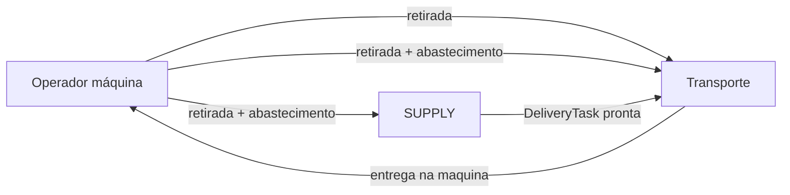

# Regras de negócio: tarefas de entrega e retirada (campainha)

Sistema tipo **campainha de restaurante**: tarefas ligadas à **máquina**, sem pedido intermediário (`MachineReplenishmentRequest` removido).

> Matriz de implementação: [`STATUS_IMPLEMENTACAO.md`](./STATUS_IMPLEMENTACAO.md)

---

## 1. Papéis

| Papel | Responsabilidade |
|-------|------------------|
| **OPERATOR_MACHINE** | Vincula máquina; **solicitar retirada** ou **retirada + abastecimento** |
| **SUPPLY_OPERATOR** | Recebe avisos; **cria tarefa de entrega** (`DeliveryTask`) com prisma, tipo e `isCritical` |
| **FORKLIFT_OPERATOR** / **FOLLOW_UP_OPERATOR** | Mesmo fluxo: fila de entregas e retiradas, sugestões de viagem, aceitar e concluir tarefas |

---

## 2. Modelos (Prisma)

### `DeliveryTask` — levar prisma até a máquina

| Campo | Descrição |
|-------|-----------|
| `machineId` | Máquina de destino |
| `movementCube` | Código do prisma |
| `typeMovimentPallet` | `FORKLIFT` ou `ANY` |
| `isCritical` | **boolean** (substitui `PriorityLevel`) |
| `acceptedBySupply` | Abastecimento aceitou/registrou a entrega |
| `preparedAt` | Pallet pronto no recebimento → entra na fila do transporte |
| `status` | `MachineTaskStatus` |

### `PickupTask` — retirar prisma da máquina → expedição

| Campo | Descrição |
|-------|-----------|
| `machineId` | Máquina de origem |
| `linkedSupplyRequestId` | FK **única** (`@unique`) e opcional para `OperatorMachineSupplyRequest`. Substitui a antiga flag heurística `triggersReplenishment`: quando preenchida, esta é *a* retirada do continuum "Entrega + Retirada" daquele aviso — vínculo explícito, gravado uma única vez no banco, nunca reinferido por status/timestamp |
| `isCritical` | Prioridade na fila |
| `status` | `MachineTaskStatus` |

### `OperatorMachineSupplyRequest`

Aviso ao abastecimento. Encerrado (`FULFILLED`) quando supply cria `DeliveryTask` para a mesma máquina (`deliveryTaskId` preenchido). Relação reversa `linkedPickupTask` aponta para a retirada amarrada (se houver) via `PickupTask.linkedSupplyRequestId`.

### Vínculo explícito "Entrega + Retirada" (`pickup-supply-link.service.ts`)

Toda a amarração entre retirada e abastecimento passa por um único módulo, `back-end/src/services/pickup-supply-link.service.ts`, com regra única e sem heurística por máquina/data:

- **Pedido combinado** (retirada + abastecimento na mesma solicitação): vínculo criado na mesma transação (`requestPickupWithReplenishment`), ou reaproveita um aviso elegível ainda não reivindicado (`findFirstEligibleUnclaimedForMachine`).
- **Retirada avulsa pedida e, depois, aviso elegível já existente/aceito na máquina**: `linkNewPickupToEligibleSupplyRequest` amarra a retirada nova ao aviso mais antigo elegível (`OPEN`, ou `FULFILLED` com entrega ainda em aberto) e ainda sem retirada vinculada.
- **Aviso pedido e, depois, retirada avulsa já existente na máquina**: `linkNewSupplyRequestToEligiblePickup` amarra o aviso novo à 1ª retirada aberta da máquina ainda sem vínculo.
- **Unicidade garantida no banco**: `PickupTask.linkedSupplyRequestId` é `@unique` — nunca duas retiradas amarram no mesmo aviso; corrida de amarração é resolvida como "não amarrado" (a retirada segue avulsa) em vez de erro.
- **Notificação ao empilhadeirista**: se o lado que já estava em rota (entrega `ASSIGNED`/`IN_PROGRESS`, ou retirada `ASSIGNED`/`IN_PROGRESS`) ganha um vínculo novo, o empilhadeirista responsável é notificado via WebSocket (`pickup_task_updated` com `reason: 'joined_active_delivery'` ou `'replenishment_linked'`) em vez do operador da máquina.

### `MovimentPalletTripSuggestion`

Par **entrega + retirada** na mesma máquina, resolvido **apenas** pela cadeia de FK explícita (`PickupTask.linkedSupplyRequestId` → `OperatorMachineSupplyRequest.deliveryTaskId` → `DeliveryTask`) em `trip-suggestion-sync.service.ts` — sem pareamento heurístico por "qual entrega/retirada está aberta na máquina agora". O empilhadeirista só vê a sugestão combinada quando a `DeliveryTask` vinculada tem `preparedAt` (pallet pronto no abastecimento). A sugestão é criada/sincronizada no `mark-prepared`, na criação da entrega, ou na listagem de `/trip-suggestions`. Entregas/retiradas sem vínculo explícito nunca formam sugestão ad-hoc — seguem cada uma na sua fila, sem interferir visual ou logicamente uma na outra.

---

## 3. OPERATOR_MACHINE — `/api/operator-machine`

| Método | Rota | Efeito |
|--------|------|--------|
| `POST` | `/pickup-only` | Cria `PickupTask` (só retirada) a qualquer momento; body opcional `{ isCritical?: boolean }`. Se já houver aviso de abastecimento elegível e ainda sem retirada vinculada na máquina, a retirada nova amarra automaticamente nele (`linkNewPickupToEligibleSupplyRequest`) e o continuum "Entrega + Retirada" passa a valer; caso contrário, fica avulsa |
| `POST` | `/pickup-with-replenishment` | Se já houver aviso elegível ainda não reivindicado na máquina, comportamento idêntico a `/pickup-only` (amarra nele, sem criar 2º aviso); caso contrário, cria `PickupTask` + `OperatorMachineSupplyRequest` OPEN juntos, já amarrados na mesma transação (par genuinamente novo, sem corrida possível). Body opcional `{ isCritical?: boolean }`. **Bloqueado** enquanto houver `DeliveryTask` em aberto para a máquina (até entrega / `COMPLETED`) |
| `POST` | `/supply-only` | Aviso ao abastecimento; no máximo um `OPEN` por máquina. Se já houver retirada avulsa aberta e sem vínculo na máquina, o aviso novo amarra nela (`linkNewSupplyRequestToEligiblePickup`). **Bloqueado** enquanto houver `DeliveryTask` em aberto para a máquina (neste caso o operador só pode `/pickup-only` até o pallet ser entregue) |
| `GET` | `/machine-tasks` | Lista `deliveryTasks` e `pickupTasks` da máquina vinculada |
| `POST` | `/pickup-tasks/:pickupTaskId/cancel` | Cancela retirada em `CREATED`; se houver `linkedSupplyRequestId`, cancela também o aviso vinculado quando seguro: `OPEN` vira `CANCELLED` direto; `FULFILLED` só é cancelado se a entrega vinculada ainda estiver `CREATED`, sem operador atribuído e sem preparo (senão o pallet já está em curso e a retirada cancelada não pode descartá-lo) |

**Removido:** `finalize`, `replenishment-requests`, pickup por `requestId`.

---

## 4. SUPPLY — `/api/delivery-tasks`

| Método | Rota | Efeito |
|--------|------|--------|
| `GET` | `/pending-supply-requests` | Avisos OPEN do setor |
| `POST` | `/` | Cria `DeliveryTask` (`acceptedBySupply: true`; opcional `markReady`) |
| `POST` | `/:taskId/mark-prepared` | Preenche `preparedAt` → fila do transporte |

Body de criação: `machineId`, `movementCube`, `typeMovimentPallet`, `isCritical?`, `markReady?`, `operatorSupplyRequestId?`.

---

## 5. Transporte — `/api/operator-moviment-pallet`

| Método | Rota | Efeito |
|--------|------|--------|
| `GET` | `/open-tasks` | `{ deliveryTasks, pickupTasks }` na fila |
| `POST` | `/tasks/:id/accept-deliver` | Aceita entrega |
| `POST` | `/tasks/:id/accept-pickup` | Aceita retirada |
| `POST` | `/tasks/:id/complete-deliver` | Conclui entrega na máquina |
| `POST` | `/tasks/:id/complete-pickup` | Conclui retirada na expedição |
| `GET` | `/trip-suggestions` | Tela principal: par entrega+retirada (2 tarefas) **somente com** `DeliveryTask.preparedAt` preenchido; ou tarefa avulsa **somente se** `isCritical`; tarefas do par nao repetem como avulsas. Se nao houver nenhuma sugestao/avulsa critica, promove **uma** avulsa nao critica (a mais antiga da fila manual) para o empilhadeirista/follow-up nao precisar abrir a fila manual |
| `POST` | `/trip-suggestions/:id/accept` | Aceita rota combinada |

**Removido:** aceitar `MachineReplenishmentRequest`.

Ordenação: `isCritical` desc, depois `createdAt` asc (sugestoes combinadas e avulsas criticas na mesma ordem de prioridade).

**Fila manual** (`/open-tasks`): somente avulsas **nao criticas** e fora de sugestao combinada.

---

## 6. Fluxo resumido



1. Supply antecipa ou responde aviso → `DeliveryTask` com `preparedAt`.
2. Transporte entrega → `DeliveryTask` COMPLETED (registro no sistema; nao e pre-requisito para retirada).
3. Operador **só retirada** (sem aviso elegível na máquina) → `PickupTask` avulsa a qualquer momento (pedido de serviço ao transporte); segue sua própria fila/fluxo, sem interferir em nenhum aviso de abastecimento.
4. Operador **só abastecimento** (sem retirada avulsa aberta na máquina) → aviso `OPEN`; segue seu próprio fluxo de "próximo prisma", sem interferir em nenhuma retirada.
5. Operador **retirada + abastecimento** (pedido combinado) → `PickupTask` + aviso amarrados na criação (mesma transação); sugestão de viagem para o transporte **após** abastecimento marcar o pallet pronto (`preparedAt`). Não permitido enquanto existir `DeliveryTask` em aberto para a máquina.
6. Operador pede **retirada** e, em seguida, **abastecimento** (ou vice-versa) para a mesma máquina, **antes de o transporte aceitar** qualquer um dos dois → os dois são amarrados automaticamente pelo `pickup-supply-link.service.ts` (retirada avulsa CREATED + aviso elegível OPEN/FULFILLED-em-aberto, sem vínculo prévio), formando o mesmo continuum "Entrega + Retirada" do item 5.
7. Se há um aviso `OPEN` na máquina, **ou** o empilhadeirista **já aceitou** a entrega vinculada a um aviso `FULFILLED` (`ASSIGNED`/`IN_PROGRESS`), e o operador dessa máquina pede retirada → a retirada nova amarra no mesmo aviso/entrega. Se a entrega já estava em rota, a retirada entra na mesma sugestão (`ACCEPTED`) e **o empilhadeirista responsável é notificado** (`reason: 'joined_active_delivery'`).
8. Simetricamente: se uma retirada avulsa já foi **aceita pelo transporte** (`ASSIGNED`/`IN_PROGRESS`) e o operador da máquina pede um aviso de abastecimento novo → o aviso amarra nessa retirada e **o empilhadeirista responsável é notificado** (`reason: 'replenishment_linked'`), mesmo sem ainda existir `DeliveryTask` para o próximo pallet.
9. Com pallet destinado à máquina (no recebimento, em preparo ou a caminho), o operador **não** pode solicitar novo abastecimento nem retirada+abastecimento até a entrega na máquina (`COMPLETED`) — apenas retirada (item 3).
10. Tarefas/continuums sem vínculo explícito entre si **nunca** se misturam visualmente: cada retirada avulsa, aviso avulso ou continuum "Entrega + Retirada" aparece em exatamente um card, resolvido só pela FK (`linkedSupplyRequestId` / `deliveryTaskId`) — sem pareamento heurístico por máquina, status ou proximidade de datas.

---

## 7. Deploy

```bash
cd back-end
npx prisma migrate deploy
npx prisma generate
```

Migrações: `20260522120000_task_based_flow` (remove tabelas antigas; dados não migrados); `20260715120000_pickup_supply_explicit_link` (adiciona `PickupTask.linkedSupplyRequestId` `@unique`; remove `triggersReplenishment`).
