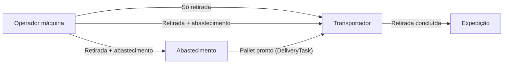

# Fork — Guia da Plataforma e Deploy para Produção

> Sistema de orquestração de movimentação de pallets/prismas no setor de **dobra**, coordenando operadores de máquina, abastecimento e transportadores (empilhadeira ou transpaleteira).

---

## Sumário

1. [O problema que resolvemos](#1-o-problema-que-resolvemos)
2. [Visão geral da plataforma](#2-visão-geral-da-plataforma)
3. [Papéis (roles) e responsabilidades](#3-papéis-roles-e-responsabilidades)
4. [Conceitos importantes](#4-conceitos-importantes)
5. [Fluxos operacionais](#5-fluxos-operacionais)
6. [Telas por papel](#6-telas-por-papel)
7. [Deploy para produção](#7-deploy-para-produção)
8. [Primeiros passos após o deploy](#8-primeiros-passos-após-o-deploy)
9. [Rotina diária por papel](#9-rotina-diária-por-papel)
10. [Regras de negócio essenciais](#10-regras-de-negócio-essenciais)
11. [Suporte e monitoramento](#11-suporte-e-monitoramento)

---

## 1. O problema que resolvemos

No setor de **dobra**, as máquinas de conformação precisam receber e devolver pallets (prismas) com frequência. Antes desta plataforma, o fluxo era informal:

- Transportadores (empilhadeiristas e transpaleteiros) **não sabiam quem atender primeiro**
- Não havia clareza sobre **levar** prisma para a máquina ou **retirar** o que já estava lá
- O abastecimento (recebimento) não tinha visibilidade das necessidades em tempo real
- Líderes de setor não conseguiam acompanhar gargalos e produtividade

A plataforma **Fork** funciona como uma **campainha de restaurante digital**: cada máquina "toca a campainha" quando precisa de algo, o abastecimento prepara o material e o transportador recebe tarefas priorizadas na fila — com sugestões inteligentes de viagem combinada (entrega + retirada na mesma máquina).

---

## 2. Visão geral da plataforma

### Arquitetura

| Camada       | Tecnologia                                 |
| ------------ | ------------------------------------------ |
| Front-end    | React 19 + Vite + TanStack Query           |
| Back-end     | Fastify + Prisma + PostgreSQL              |
| Tempo real   | WebSocket (atualização de filas e tarefas) |
| Autenticação | JWT (cartão + unidade + senha)             |
| Deploy       | Docker Compose                             |

### Unidades

O sistema opera em duas plantas:

- **PEDERTRACTOR**
- **TRACTOR**

Cada colaborador pertence a uma unidade e se identifica pelo **número do cartão** no login.

### Os três atores do dia a dia

```
┌─────────────────────┐     ┌─────────────────────┐     ┌─────────────────────┐
│  Operador de máquina │     │    Abastecimento     │     │   Transportador      │
│  (dobra)             │     │    (supply)          │     │   (empilhadeira ou  │
│                      │     │                      │     │    transpaleteira)   │
│  Vincula máquina     │     │  Prepara pallets     │     │  Executa entregas    │
│  Solicita retirada   │────▶│  Cria tarefas de     │────▶│  e retiradas         │
│  ou abastecimento    │     │  entrega             │     │  Aceita sugestões    │
└─────────────────────┘     └─────────────────────┘     └─────────────────────┘
```

---

## 3. Papéis (roles) e responsabilidades

| Papel                       | Código no sistema    | Quem é                            | O que faz                                                           |
| --------------------------- | -------------------- | --------------------------------- | ------------------------------------------------------------------- |
| **Operador de máquina**     | `OPERATOR_MACHINE`   | Colaborador na dobra              | Vincula-se a uma máquina; solicita retirada, abastecimento ou ambos |
| **Abastecimento**           | `SUPPLY_OPERATOR`    | Recebimento / supply              | Recebe avisos; prepara pallets; cria tarefas de entrega             |
| **Transportador de pallet** | `PALLET_TRANSPORTER` | Empilhadeirista ou transpaleteiro | Escolhe equipamento no turno; aceita e conclui tarefas da fila      |
| **Líder de setor**          | `LEADER`             | Supervisor da dobra               | Dashboard, cadastros, cria usuários do setor                        |
| **Administrador**           | `ADMIN`              | TI / responsável pelo sistema     | Tudo do líder + setores, papéis, reset de senha                     |
| **Superadministrador**      | `SUPERADMIN`         | Implantação inicial               | Acesso total; criado automaticamente no seed                        |

### Hierarquia de permissões

```
SUPERADMIN ──▶ acesso total (bypass de todas as restrições)
     │
   ADMIN ──▶ setores, usuários, cadastros, dashboard, testes
     │
   LEADER ──▶ dashboard, cadastros, usuários do setor (papéis operacionais)
     │
   SUPPLY_OPERATOR ──▶ abastecimento e cadastro de máquinas
     │
   OPERATOR_MACHINE ──▶ operação na dobra
     │
   PALLET_TRANSPORTER ──▶ movimentação de pallets
```

### Quem pode criar usuários

| Quem cria              | Pode criar                                                                         |
| ---------------------- | ---------------------------------------------------------------------------------- |
| **ADMIN / SUPERADMIN** | Qualquer papel (ADMIN não cria SUPERADMIN)                                         |
| **LEADER**             | Apenas `OPERATOR_MACHINE`, `PALLET_TRANSPORTER` e `SUPPLY_OPERATOR` do mesmo setor |

### Tela inicial após login

| Papel                       | Vai para                                                          |
| --------------------------- | ----------------------------------------------------------------- |
| ADMIN / SUPERADMIN / LEADER | `/dashboard`                                                      |
| SUPPLY_OPERATOR             | `/abastecimento/preparo-pendente`                                 |
| OPERATOR_MACHINE            | `/dobra/operacao`                                                 |
| PALLET_TRANSPORTER          | `/operacao/equipamento` (escolher empilhadeira ou transpaleteira) |

---

## 4. Conceitos importantes

### Prisma / Pallet / Movement Cube

Código do material (prisma) que será movimentado entre recebimento, máquina e expedição.

### Tarefa de entrega (`DeliveryTask`)

Levar um prisma **do recebimento até a máquina**.

- Criada pelo abastecimento
- Só entra na fila do transportador quando o pallet está **pronto** (`preparedAt` preenchido)
- Pode exigir empilhadeira (`FORKLIFT`) ou aceitar qualquer meio (`ANY`)

### Tarefa de retirada (`PickupTask`)

Retirar o prisma **da máquina até a expedição**.

- Criada pelo operador de máquina
- Pode ser **só retirada** ou **retirada + abastecimento** (dispara aviso ao supply)

### Aviso ao abastecimento (`OperatorMachineSupplyRequest`)

Notificação de que uma máquina precisa de reposição. Encerrado automaticamente quando o abastecimento cria a tarefa de entrega correspondente.

### Sugestão de viagem (`MovimentPalletTripSuggestion`)

Par **entrega + retirada** na mesma máquina, oferecido ao transportador para otimizar deslocamento. Só aparece quando o pallet de entrega já está pronto no recebimento.

### Prioridade crítica (`isCritical`)

Tarefas marcadas como críticas sobem na fila. Ordenação: **crítico primeiro**, depois **mais antigo primeiro**.

### Modo de operação (`isOperating`)

No início do turno, o transportador escolhe:

- `FORKLIFT` — empilhadeira
- `PALLET_TRUCK` — transpaleteira

Isso filtra quais tarefas ele pode aceitar (tarefas que exigem empilhadeira só aparecem para quem está em modo empilhadeira).

### Status das tarefas

```
CREATED → ASSIGNED → IN_PROGRESS → COMPLETED
                                  ↘ CANCELED
```

---

## 5. Fluxos operacionais

### Fluxo geral (visão macro)



> **Retirada:** pedido de serviço ao transporte — o operador pode solicitar a qualquer momento, assumindo que há pallet na máquina (sem exigir entrega registrada no sistema).

---

### 5.1 Fluxo do operador de máquina

**Objetivo:** avisar que a máquina precisa de material ou que o pallet atual deve sair.

| Passo | Ação                   | Detalhe                                                   |
| ----- | ---------------------- | --------------------------------------------------------- |
| 1     | **Vincular máquina**   | No início do turno, seleciona a máquina em que vai operar |
| 2     | **Escolher operação**  | Uma das três opções abaixo                                |
| 3     | **Acompanhar tarefas** | Vê status de entregas e retiradas da sua máquina          |

**Três tipos de solicitação:**

| Botão                        | O que acontece                                               | Quem é notificado             |
| ---------------------------- | ------------------------------------------------------------ | ----------------------------- |
| **Só retirada**              | Cria `PickupTask` — transportador retira o pallet da máquina | Transportador                 |
| **Só abastecimento**         | Cria aviso ao abastecimento — supply prepara e cria entrega  | Abastecimento                 |
| **Retirada + abastecimento** | Cria retirada **e** aviso ao abastecimento ao mesmo tempo    | Transportador + Abastecimento |

> **Retirada:** o operador pode solicitar a qualquer momento (pedido de serviço ao transporte). Não exige entrega concluída registrada no sistema.

---

### 5.2 Fluxo do abastecimento

**Objetivo:** preparar pallets e colocá-los na fila do transportador.

| Passo | Ação                     | Detalhe                                                       |
| ----- | ------------------------ | ------------------------------------------------------------- |
| 1     | **Ver avisos pendentes** | Lista de máquinas que pediram abastecimento (`OPEN`)          |
| 2     | **Preparar pallet**      | Informa código do prisma, tipo de movimentação e se é crítico |
| 3     | **Marcar como pronto**   | Preenche `preparedAt` → tarefa entra na fila do transportador |
| 4     | **Antecipar entrega**    | Pode criar entrega antes do aviso (supply proativo)           |

Ao criar a entrega, avisos abertos da mesma máquina são encerrados automaticamente.

---

### 5.3 Fluxo do transportador

**Objetivo:** executar entregas e retiradas de forma ordenada e eficiente.

| Passo | Ação                        | Detalhe                                                        |
| ----- | --------------------------- | -------------------------------------------------------------- |
| 1     | **Escolher equipamento**    | Empilhadeira ou transpaleteira (início do turno)               |
| 2     | **Ver sugestões de viagem** | Pares entrega+retirada na mesma máquina (prioridade)           |
| 3     | **Aceitar tarefa**          | Sugestão combinada ou tarefa avulsa da fila                    |
| 4     | **Executar entrega**        | Leva prisma até a máquina → marca concluída                    |
| 5     | **Executar retirada**       | Retira prisma da máquina → leva à expedição → marca concluída  |
| 6     | **Fila manual**             | Tarefas não críticas avulsas, quando não há sugestão combinada |

**Prioridade da fila:**

1. Sugestões de viagem (entrega + retirada) — com pallet pronto
2. Tarefas avulsas **críticas**
3. Tarefas avulsas normais (fila manual)

---

### 5.4 Fluxo do líder / administrador

**Objetivo:** configurar o ambiente e acompanhar a operação.

| Área                     | Função                                                        |
| ------------------------ | ------------------------------------------------------------- |
| **Dashboard**            | Visão geral do setor, métricas e trajetória por transportador |
| **Cadastro de máquinas** | Registrar máquinas de dobra por setor                         |
| **Cadastro de tipos**    | Tipos de máquina (com foto)                                   |
| **Setores**              | Centros de custo e agrupamento (somente ADMIN)                |
| **Usuários**             | Criar colaboradores, atribuir papéis, resetar senha           |

---

## 6. Telas por papel

| Rota                              | Tela                                      | Papéis                    |
| --------------------------------- | ----------------------------------------- | ------------------------- |
| `/login`                          | Login (cartão + unidade + senha)          | Todos                     |
| `/definir-senha`                  | Primeira senha (obrigatório no 1º acesso) | Todos                     |
| `/dashboard`                      | Painel operacional                        | LEADER, ADMIN, SUPERADMIN |
| `/cadastro/tipos-maquina`         | Tipos de máquina                          | LEADER, ADMIN             |
| `/cadastro/maquinas`              | Máquinas de produção                      | LEADER, ADMIN             |
| `/abastecimento/solicitacoes`     | Solicitações de reposição                 | SUPPLY, LEADER, ADMIN     |
| `/abastecimento/preparo-pendente` | Preparo pendente (wizard)                 | SUPPLY, LEADER, ADMIN     |
| `/administracao/setores`          | Setores                                   | ADMIN, SUPERADMIN         |
| `/administracao/usuarios`         | Usuários                                  | LEADER, ADMIN             |
| `/dobra/operacao`                 | Operação na dobra                         | OPERATOR_MACHINE          |
| `/operacao/equipamento`           | Escolher empilhadeira/transpaleteira      | PALLET_TRANSPORTER        |
| `/operacao/aceitar-tarefas`       | Tarefas disponíveis (sugestões)           | PALLET_TRANSPORTER        |
| `/operacao/filas-manuais`         | Fila manual                               | PALLET_TRANSPORTER        |
| `/operacao/minhas-tarefas`        | Tarefas em execução                       | PALLET_TRANSPORTER        |

---

## 7. Deploy para produção

### 7.1 Pré-requisitos

- Docker e Docker Compose instalados no servidor
- Acesso à API de colaboradores (`URL_VERIFY_EMPLOYEES`) — usada no login e na criação de usuários
- Portas disponíveis (padrão: **3131** API, **5173** front-end, **5432** PostgreSQL)
- Certificado/rede interna conforme política da empresa (recomendado: Nginx reverso com HTTPS)

### 7.2 Variáveis de ambiente

#### Raiz do projeto (`.env`)

Copie `.env.example` para `.env` na raiz:

```env
POSTGRES_USER=forklift
POSTGRES_PASSWORD=<senha-forte>
POSTGRES_DB=forklift_db
POSTGRES_PORT=5432

FRONTEND_PORT=5173

# Em produção com proxy reverso (nginx do front-end), use o path da API:
VITE_BASE_URL_API=/api
```

#### Back-end (`back-end/.env`)

Copie `back-end/.env.example` para `back-end/.env`:

```env
HOST=0.0.0.0
PORT=3131

# Sobrescrito pelo docker-compose; manter consistente:
DATABASE_URL=postgresql://forklift:<senha>@postgresql-forklift:5432/forklift_db?schema=public

JWT_SECRET=<string-longa-e-aleatoria>
JWT_EXPIRES_IN=7d

FIRST_PASSWORD=<senha-inicial-para-novos-usuarios>

URL_VERIFY_EMPLOYEES=http://<host-interno>:8886/api
APPNAME=project_forklift
APPKEY=<chave-da-api-de-colaboradores>

UPLOAD_DIR=uploads
```

> **Importante:** `JWT_SECRET` e `POSTGRES_PASSWORD` devem ser únicos e seguros em produção. Nunca commitar `.env` no repositório.

### 7.3 Subir os containers

Na raiz do projeto:

```bash
docker compose up -d --build
```

O que acontece na primeira subida:

1. PostgreSQL sobe e persiste dados no volume `postgres_data_forklift`
2. Back-end executa `prisma migrate deploy` (aplica migrações)
3. Back-end executa `prisma db seed` (cria SUPERADMINs iniciais)
4. Back-end inicia na porta **3131**
5. Front-end inicia na porta configurada em `FRONTEND_PORT`

### 7.4 Verificar saúde

```bash
# Health check da API
curl http://localhost:3131/api/health

# Status dos containers
docker compose ps

# Logs (se algo falhar)
docker compose logs back-end
docker compose logs front-end
```

Resposta esperada do health check: status OK.

### 7.5 Produção com Nginx (recomendado)

O front-end em Docker roda Vite em modo dev. Para produção robusta, recomenda-se:

1. Build estático do front-end (`npm run build` na pasta `front-end`)
2. Servir `dist/` via Nginx
3. Proxy `/api` e `/ws` para o back-end na porta 3131
4. Proxy `/uploads` para arquivos estáticos do back-end

Exemplo de blocos Nginx:

```nginx
location /api/ {
    proxy_pass http://127.0.0.1:3131/api/;
}

location /ws/ {
    proxy_pass http://127.0.0.1:3131/ws/;
    proxy_http_version 1.1;
    proxy_set_header Upgrade $http_upgrade;
    proxy_set_header Connection "upgrade";
}

location /uploads/ {
    proxy_pass http://127.0.0.1:3131/uploads/;
}
```

### 7.6 Checklist de deploy

- [ ] `.env` da raiz configurado (PostgreSQL + portas)
- [ ] `back-end/.env` configurado (JWT, FIRST_PASSWORD, API de colaboradores)
- [ ] `URL_VERIFY_EMPLOYEES` acessível a partir do container back-end
- [ ] `docker compose up -d --build` executado sem erros
- [ ] `GET /api/health` retorna OK
- [ ] Login com cartão SUPERADMIN do seed funciona
- [ ] Primeira senha definida com sucesso
- [ ] HTTPS configurado (se exposto fora da rede interna)
- [ ] Backup do volume PostgreSQL agendado

---

## 8. Primeiros passos após o deploy

Siga esta ordem na **primeira implantação**. Cada etapa depende da anterior.

### Passo 1 — Acesso inicial (SUPERADMIN)

O seed cria automaticamente usuários SUPERADMIN (cartões definidos em `back-end/prisma/seed.ts`).

1. Acesse a URL do front-end
2. Faça login com **cartão + unidade (TRACTOR ou PEDERTRACTOR) + senha inicial** (`FIRST_PASSWORD`)
3. Defina sua senha definitiva em `/definir-senha`

### Passo 2 — Cadastrar setores (ADMIN)

1. Menu **Administração → Setores**
2. Crie o setor de dobra (ex.: "Dobra — Tractor")
3. Associe os centros de custo relevantes

### Passo 3 — Cadastrar tipos e máquinas (LEADER ou ADMIN)

1. **Cadastro → Tipos de máquina** — cadastre os tipos (ex.: "Dobradeira CNC") com foto
2. **Cadastro → Máquinas de produção** — cadastre cada máquina do setor, vinculada ao tipo e unidade correta

### Passo 4 — Criar usuários operacionais (LEADER ou ADMIN)

1. Menu **Administração → Usuários**
2. Informe o **cartão** do colaborador (dados vêm da API de RH)
3. Atribua o papel correto:

| Colaborador                        | Papel                |
| ---------------------------------- | -------------------- |
| Operadores na dobra                | `OPERATOR_MACHINE`   |
| Equipe do recebimento              | `SUPPLY_OPERATOR`    |
| Empilhadeiristas e transpaleteiros | `PALLET_TRANSPORTER` |
| Supervisor do setor                | `LEADER`             |

4. Vincule cada usuário ao **setor** correto
5. Comunique a **senha inicial** (`FIRST_PASSWORD`) — todos devem trocar no primeiro login

### Passo 5 — Teste ponta a ponta (recomendado antes de liberar)

Simule um ciclo completo com contas de teste:

```
1. OPERATOR_MACHINE → vincula máquina → solicita abastecimento
2. SUPPLY_OPERATOR → vê aviso → prepara pallet → marca pronto
3. PALLET_TRANSPORTER → escolhe equipamento → aceita entrega → conclui na máquina
4. OPERATOR_MACHINE → solicita retirada
5. PALLET_TRANSPORTER → aceita retirada → conclui na expedição
```

Se o ciclo completo funcionar, o ambiente está pronto para operação.

### Passo 6 — Comunicar a operação

Distribua este guia (ou um resumo operacional) para:

- Operadores de máquina → foco na seção [5.1](#51-fluxo-do-operador-de-máquina)
- Abastecimento → foco na seção [5.2](#52-fluxo-do-abastecimento)
- Transportadores → foco na seção [5.3](#53-fluxo-do-transportador)
- Líderes → foco na seção [5.4](#54-fluxo-do-líder--administrador)

---

## 9. Rotina diária por papel

### Operador de máquina (início do turno)

1. Login → vai para **Operação na dobra**
2. **Vincular** a máquina em que vai trabalhar
3. Quando precisar de material ou retirada, usar um dos três botões
4. Acompanhar status das tarefas na mesma tela
5. Ao fim do turno, **desvincular** a máquina (se aplicável)

### Abastecimento (início do turno)

1. Login → vai para **Preparo pendente**
2. Monitorar avisos de máquinas que pediram reposição
3. Preparar pallet, informar código do prisma e marcar **pronto**
4. Opcionalmente antecipar entregas antes do aviso

### Transportador (início do turno)

1. Login → escolher **Empilhadeira** ou **Transpaleteira**
2. Abrir **Tarefas disponíveis** — priorizar sugestões de viagem
3. Aceitar tarefa → executar → marcar **concluída** no destino
4. Repetir até fila zerada; usar **Fila manual** para tarefas avulsas não críticas
5. **Minhas tarefas** mostra o que está em andamento

### Líder (acompanhamento)

1. Login → **Painel operacional** (dashboard)
2. Verificar gargalos, transportadores ativos e tarefas pendentes
3. Ajustar cadastros e usuários conforme necessidade

---

## 10. Regras de negócio essenciais

Estas regras evitam conflitos na operação. Vale comunicar à equipe:

| Regra                                                       | Explicação                                                                                                                                |
| ----------------------------------------------------------- | ----------------------------------------------------------------------------------------------------------------------------------------- |
| **Retirada livre**                                          | Operador da máquina pode solicitar retirada a qualquer momento — pedido de serviço ao transporte, sem exigir entrega concluída no sistema |
| **Pallet no recebimento bloqueia abastecimento**            | Se já existe pallet preparado aguardando entrega, o operador **só pode pedir retirada** — não abastecimento nem retirada+abastecimento    |
| **Entrega só entra na fila quando pronta**                  | Transportador só vê a entrega após abastecimento marcar `preparedAt`                                                                      |
| **Sugestão de viagem = entrega pronta + retirada pendente** | Otimiza deslocamento: levar e buscar na mesma ida                                                                                         |
| **Crítico sobe na fila**                                    | Tarefas marcadas como críticas têm prioridade sobre as demais                                                                             |
| **Tipo de equipamento importa**                             | Tarefas `FORKLIFT` só aparecem para quem está operando empilhadeira                                                                       |
| **Cancelamento de retirada**                                | Operador pode cancelar retirada em status `CREATED`; se era retirada+abastecimento, cancela também o aviso ao supply                      |

---

## 11. Suporte e monitoramento

### Endpoints úteis

| Endpoint           | Uso                              |
| ------------------ | -------------------------------- |
| `GET /api/health`  | Verificar se a API está no ar    |
| `GET /api/auth/me` | Validar sessão do usuário logado |

### Logs

```bash
docker compose logs -f back-end    # API e erros de negócio
docker compose logs -f front-end   # Front-end
docker compose logs -f postgresql-forklift  # Banco
```

### Problemas comuns

| Sintoma                       | Possível causa                                              | Ação                                                         |
| ----------------------------- | ----------------------------------------------------------- | ------------------------------------------------------------ |
| Login falha para todos        | API de colaboradores inacessível                            | Verificar `URL_VERIFY_EMPLOYEES` e rede                      |
| Seed falha no deploy          | Cartão do seed não existe na API RH                         | Ajustar cartões em `prisma/seed.ts` ou cadastrar colaborador |
| Fila vazia para transportador | Nenhum pallet marcado como pronto                           | Abastecimento deve marcar `preparedAt`                       |
| Retirada não aparece na fila  | Pedido ainda não aceito ou tipo de equipamento incompatível | Verificar status da tarefa e equipamento vinculado           |
| WebSocket não atualiza        | Proxy sem suporte a Upgrade                                 | Configurar Nginx para `/ws/`                                 |

### Backup do banco

O volume Docker `postgres_data_forklift` contém todos os dados. Agende backup periódico:

```bash
docker exec postgresql-forklift pg_dump -U <POSTGRES_USER> <POSTGRES_DB> > backup_$(date +%Y%m%d).sql
```

---

## Referências técnicas

| Documento                                            | Conteúdo                           |
| ---------------------------------------------------- | ---------------------------------- |
| `back-end/docs/REGRAS_NEGOCIO_REPOSICAO_OPERADOR.md` | Regras de negócio detalhadas (API) |
| `back-end/prisma/schema.prisma`                      | Modelos de dados                   |
| `docker-compose.yaml`                                | Orquestração dos serviços          |
| `front-end/src/App.tsx`                              | Rotas do front-end                 |

---

_Documento gerado para implantação em produção — Fork (Forklift Flow)._
